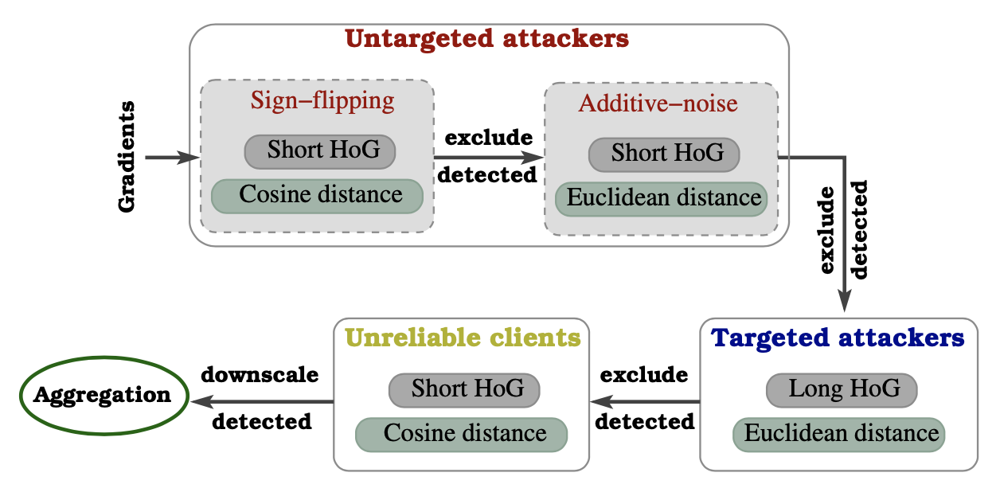

**This repository contains source code of the ESORICS 2022 paper: 

# Long-Short History of Gradients is All You Need: Detecting Malicious and Unreliable Clients in Federated Learning

### Abstract:
Federated learning offers a framework of training a machine learning model in a distributed fashion while preserving privacy of the participants.
As the server cannot govern the clients’ actions, nefarious clients may attack the global model by sending malicious local gradients.
In the meantime, there could also be *unreliable* clients who are *benign* but each has a portion of low-quality training data (e.g., blur or low-resolution images),
thus may appearing similar as malicious clients.
Therefore, a defense mechanism will need to perform a *three-fold* differentiation which is much more challenging than the conventional (two-fold) case.
This paper introduces MUD-HoG, a novel defense algorithm that addresses this challenge in federated learning using *long-short history of gradients*,
and treats the detected malicious and unreliable clients differently.
Not only this, but we can also distinguish between *targeted* and *untargeted attacks* among malicious clients,
unlike most prior works which only consider one type of the attacks.
Specifically, we take into account sign-flipping, additive-noise, label-flipping, and multi-label-flipping attacks, under a non-IID setting.
We evaluate MUD-HoG with six state-of-the-art methods on two datasets.
The results show that MUD-HoG outperforms all of them in terms of accuracy as well as precision and recall,
in the presence of a mixture of multiple (four) types of attackers as well as unreliable clients.
Moreover, unlike most prior works which can only tolerate a low population of harmful users,
MUD-HoG can work with and successfully detect a wide range of malicious and unreliable clients - up to 47.5% and 10%, respectively, of the total population.



### Citation:
```
@inproceedings{mudhog-esorics2022,
  title={Long-Short History of Gradients is All You Need: Detecting Malicious and Unreliable Clients in Federated Learning},
  author={Ashish, Gupta1 and Tie, Luo and Mao V., Ngo, and Sajal K., Das},
  booktitle={European Symposium on Research in Computer Security (ESORICS)},
  year={2022},
}
```

## User guide:
* Create a virtual environment:
```
virtualenv -p python3 venv
source venv/bin/activate
```

* <summary>Usage:</summary>
You can refer to a script to run experiments: `run_hete_fashion.sh`

More arguments options can be found below:

```
$ python main.py --help
usage: main.py [-h] [--batch_size BATCH_SIZE]                                                                                                                                  
               [--test_batch_size TEST_BATCH_SIZE] [--epochs EPOCHS]                                                                                                           
               [--optimizer OPTIMIZER] [--lr LR] [--momentum MOMENTUM]                                                                                                         
               [--weight_decay WEIGHT_DECAY] [--seed SEED]                                                                                                                     
               [--log_interval LOG_INTERVAL] [-n NUM_CLIENTS]                                                                                                                  
               [--output_folder OUTPUT_FOLDER]                                                                                                                                 
               [--dataset {mnist,cifar,cifar100,imdb,fashion_mnist}]                                                                                                           
               [--loader_type {iid,byLabel,dirichlet}]                                                                                                                         
               [--loader_path LOADER_PATH]                                                                                                                                     
               [--AR {fedavg,median,gm,krum,mkrum,foolsgold,residualbase,attention,mlp,mudhog,fedavg_oracle}]                                                                  
               [--n_attacker_backdoor N_ATTACKER_BACKDOOR]                                                                                                                     
               [--backdoor_trigger [BACKDOOR_TRIGGER [BACKDOOR_TRIGGER ...]]]                                                                                                  
               [--n_attacker_semanticBackdoor N_ATTACKER_SEMANTICBACKDOOR]
               [--n_attacker_labelFlipping N_ATTACKER_LABELFLIPPING]
               [--n_attacker_labelFlippingDirectional N_ATTACKER_LABELFLIPPINGDIRECTIONAL]
               [--n_attacker_omniscient N_ATTACKER_OMNISCIENT]
               [--omniscient_scale OMNISCIENT_SCALE] [--attacks ATTACKS]
               [--save_model_weights] [--experiment_name EXPERIMENT_NAME]
               [--path_to_aggNet PATH_TO_AGGNET] [--device {cuda,cpu}]
               [--inner_epochs INNER_EPOCHS] [--verbose]
               [--list_unreliable LIST_UNRELIABLE]
               [--unreliable_fraction UNRELIABLE_FRACTION]
               [--unreliable_fracTrain UNRELIABLE_FRACTRAIN]
               [--mean_unreliable MEAN_UNRELIABLE]
               [--blur_method {add_noise,gaussian_smooth}]
               [--max_std_unreliable MAX_STD_UNRELIABLE]
               [--list_uatk_add_noise LIST_UATK_ADD_NOISE]
               [--mean_add_noise MEAN_ADD_NOISE]
               [--std_add_noise STD_ADD_NOISE]
               [--list_uatk_flip_sign LIST_UATK_FLIP_SIGN]
               [--list_tatk_label_flipping LIST_TATK_LABEL_FLIPPING]
               [--list_tatk_multi_label_flipping LIST_TATK_MULTI_LABEL_FLIPPING]
               [--source_labels SOURCE_LABELS] [--target_label TARGET_LABEL]
               [--list_tatk_backdoor LIST_TATK_BACKDOOR]

optional arguments:
  -h, --help            show this help message and exit
  --batch_size BATCH_SIZE
                        Default=64
  --test_batch_size TEST_BATCH_SIZE
                        Default=64
  --epochs EPOCHS       Default is 10 epochs.
  --optimizer OPTIMIZER
                        Default is SGD optimizer
  --lr LR               Learning rate of models. Default=0.01.
  --momentum MOMENTUM   Default momentum is 0.5.
  --weight_decay WEIGHT_DECAY
                        Default weight_decay is 0.
  --seed SEED           Default is 1.
  --log_interval LOG_INTERVAL
                        Default log_interval is 11.
  -n NUM_CLIENTS, --num_clients NUM_CLIENTS
                        Default is 10 clients.
  --output_folder OUTPUT_FOLDER
                        path to output folder, e.g. "experiment"
  --dataset {mnist,cifar,cifar100,imdb,fashion_mnist}
                        Default is mnist dataset.
  --loader_type {iid,byLabel,dirichlet}
                        Default is iid data distribution.
  --loader_path LOADER_PATH
                        where to save the data partitions. Default is
                        ./data/loader.pk
  --AR {fedavg,median,gm,krum,mkrum,foolsgold,residualbase,attention,mlp,mudhog,fedavg_oracle}
                        Aggregation rule. Default is fedavg.
  --n_attacker_backdoor N_ATTACKER_BACKDOOR
                        Default is no attacker backdoor.
  --backdoor_trigger [BACKDOOR_TRIGGER [BACKDOOR_TRIGGER ...]]
                        the hyperparameter for backdoor trigger, do
                        `--backdoor_trigger x_offset y_offset x_interval
                        y_interval`
  --n_attacker_semanticBackdoor N_ATTACKER_SEMANTICBACKDOOR
  --n_attacker_labelFlipping N_ATTACKER_LABELFLIPPING
  --n_attacker_labelFlippingDirectional N_ATTACKER_LABELFLIPPINGDIRECTIONAL
  --n_attacker_omniscient N_ATTACKER_OMNISCIENT
  --omniscient_scale OMNISCIENT_SCALE
  --attacks ATTACKS     if contains "backdoor", activate the corresponding
                        tests
  --save_model_weights
  --experiment_name EXPERIMENT_NAME
  --path_to_aggNet PATH_TO_AGGNET
  --device {cuda,cpu}
  --inner_epochs INNER_EPOCHS
  --verbose
  --list_unreliable LIST_UNRELIABLE
                        List of unreliable clients, separate by comma ',',
                        e.g., "1,2". Default is None.
  --unreliable_fraction UNRELIABLE_FRACTION
                        Fraction of local dataset is added noise to simulate
                        unreliable client. Default is 0.5.
  --unreliable_fracTrain UNRELIABLE_FRACTRAIN
                        Fraction of local dataset is used to trained the local
                        model. Default is 0.3.
  --mean_unreliable MEAN_UNRELIABLE
                        Mean of Gaussian noise add to raw image for unreliable
                        clients. Default is 0
  --blur_method {add_noise,gaussian_smooth}
                        Method to make low quality image (use std=50).
                        Default: gaussian_smooth
  --max_std_unreliable MAX_STD_UNRELIABLE
                        Max Standard deviation of Gaussian noise add to raw
                        image (below 1), or generate weight Gaussian smooth
                        filter (std=50) for unreliable clients. Value in
                        (0,1]. Default is 50 (for gaussian_smooth).
  --list_uatk_add_noise LIST_UATK_ADD_NOISE
                        List of untargeted attacks, sending: Gaussian noise +
                        gradient updates.
  --mean_add_noise MEAN_ADD_NOISE
                        Mean of additive Gaussian noise add to grad for
                        untargeted attack. Default is 0.
  --std_add_noise STD_ADD_NOISE
                        Standard deviation of additive Gaussian noise add to
                        grad for untargeted attack. Default is 0.01.
  --list_uatk_flip_sign LIST_UATK_FLIP_SIGN
                        List of untargeted attacks, sending flipping sign of
                        gradient updates.
  --list_tatk_label_flipping LIST_TATK_LABEL_FLIPPING
                        List of targeted attacks, change label from
                        source_label(1) to target_label(7).
  --list_tatk_multi_label_flipping LIST_TATK_MULTI_LABEL_FLIPPING
                        List of targeted attacks, change label from
                        source_label(1) to target_label(7).
  --list_tatk_multi_label_flipping LIST_TATK_MULTI_LABEL_FLIPPING
                        List of targeted attacks, change few labels from
                        source_label(1,2,3) to target_label(7).
  --source_labels SOURCE_LABELS
                        Default of source label flipping is 1.
  --target_label TARGET_LABEL
                        Default of source label flipping is 7.
  --list_tatk_backdoor LIST_TATK_BACKDOOR
                        List of targeted backdoor attack, manipulate label 2
                        in MNIST. Same meaning as n_attacker_backdoor, but
                        list input option.
```

